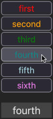

# Passing props #

Visit [this page](https://funforks.github.io/passing-props), where you will see a demo of a React app that you can create.

When you click on one of the buttons in the list, the text of the button is shown in the paragraph below the list.



Your mission is to recreate this app. You will need to:
* Display a list of buttons
* Set the text of each button from data in a JSON file
* Set the color of the text of each button from the same data
* Display the text of any button that you click on in a different element

## Files that you don't need to change

The names and the colours for the buttons is stored in an array in `buttonData.json`

`index.css` already contains CSS rulesets for `body`, `ul`, `button` and `p` elements.

Please don't make any changes to these two files.

## Files that you *should* edit

You'll find three files which are incomplete:

```md
src 
├── components/
│   ├── List.jsx
│   └── ListItem.jsx 
└── App.jsx
```

Your mission is to complete these files. Note the `<p>` element that is defined in `App.jsx`. This is the element that should show the text of the button that is clicked on. Note also that the buttons are defined in a different React component.

The challenge is to work out how to pass data from the `App.jsx` file to other components, and how to pass data back from other compenents to `App.jsx`.

### Hints:
1. You can create a function in App.jsx and pass the function as a prop to a child component
2. This function can set a `useState` variable from data that it receives when it is triggered, like you did in the Light Switch exercise
3. The `<p>` element has direct access to any `useState` variable that is defined in App.jsx
4. You can use the `.map()` Array method to generate an array of `<ListItem />` components
5. One component can its `props` on to its own children
6. An `onClick` action will generate an `event` object with a `target` property. (Remember what you know about [event delegation](https://www.google.com/search?q=event+delegation+react)?)
7. The assignment rules say that you should not change the CSS file. But you can [ask Google](https://www.google.com/search?q=inline+style+react) how to apply an inline style to an element.